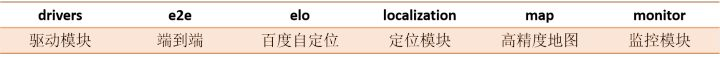
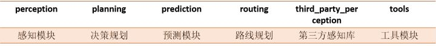

# 1. 面向对象

## 1.1. Apollo

- 低版本: 面向封闭场所的无人驾驶
- 高版本: 面向城市区域的无人驾驶为主

## 1.2. AutoWare 1.0

- 主要面向封闭区域

# 2. 项目架构

## 2.1. 基本架构

- Apollo(完善但复杂)







- AutoWare1.0(简化但Main)


# 3. 技术

## 3.1. Localization

### 3.1.1. 技术简介

#### Apollo中的定位技术

- RTK模式: 为了方便调试，Apollo自行实现了一套RTK解算，只使用RTK的定位信息。

> 现在惯导芯片一般都会配一个板卡（NovAtel也卖这样的板卡），直接集成了RTK的定位结果。为什么我们还需要自己开发GNSS-RTK呢？ 
> 从系统的角度考虑，需要每个子模块都是可控的，举一个简单的例子，当给出一个定位结果偏了，但给出的方差很小，也就是置信度很高。我们是没办法知道原因的。

- MSF(Multiple Sensor Fusion)模式: 采用Kalman滤波器，对位置、姿态和速度进行融合。
  
  - IMU: 惯导解算
  - LIDAR: NDT匹配算法
  - GPS: RTK解算
  
  使用松耦合的方式把惯性导航解算、GNSS定位、点云定位三个子模块融合在一起。(松耦合and紧耦合: 松耦合的数据只有位置、速度、姿态，紧耦合会包括GNSS的导航参数、定位中的伪距、距离变化等。)

  使用了一个误差卡尔曼滤波器，惯性导航解算的结果用于kalman滤波器的时间更新，也就是预测；而GNSS、点云定位结果用于kalman滤波器的量测更新
  
  

#### Autoware(ROS)中的定位技术

- 基于3D Lidar的定位: 采用NDT点云配准算法进行定位，分别实现了
  - 基于PCL的NDT算法
  - 自行实现的NDT算法
  - 改进的NDT算法:NDT-TKU

- GNSS: 借助ROS社区，直接使用ROS开源的GNSS驱动，读取GPS-RTK的定位信息

参考文档

1. [Autoware.AI NDT文档](https://autowarefoundation.gitlab.io/autoware.auto/AutowareAuto/ndt-review.html)
2. [Autoware.AI 定位设计](https://autowarefoundation.gitlab.io/autoware.auto/AutowareAuto/localization-design.html)
3. [NDT定位算法原理](http://www.diva-portal.org/smash/get/diva2:276162/FULLTEXT02.pdf)


### 3.1.2. 技术成熟度

#### Apollo

Apollo实现的RTK解算、MSF传感器融合定位，都有成熟的理论指导，成熟度较高。并且从Apollo最近的几个版本来看，定位模块的改动不大。

#### Autoware

Autoware采用的NDT定位算法是2009年的一篇博士论文，目前仍被广泛应用，技术相对成熟，并且名古屋大学教授对此进行了改进，即NDT-TKU算法


### 3.1.3. 技术前沿性

从定位技术的前沿性来看，Apollo比Autoware领先，并且更加完善

#### Apollo

从目前现有的代码来看，Apollo的RTK、MSF定位都是基于传统技术如:

- RTK解算
- GNSS/IMU解算
- NDT点云匹配
- ESKF误差卡尔曼

的堆叠，但是实际上Apollo提出了许多新的算法，如基于深度学习的点云匹配，基于深度学习的定位融合，虽然目前没有直接在Apollo代码中实现，不排除后续升级版本对定位模块的改进。

#### Autoware

Autoware主要面向封闭环境，因此其认为，使用3D Lidar SLAM足以解决封闭环境的定位问题，而没有像Apollo那样实现GPS/IMU的融合解算，只是使用了EKF来对3D激光点云定位和GPS定位进行了融合，其`GPS定位信息转换模块`值得学习一下。

### 3.1.4. 源码开放度

#### Apollo

Apollo虽说开源，但是核心部分还是抓的死死的，其中包括

- rtk解算`gnss_solver`
- 点云定位`lidar_locator`
- 惯导解算`sins.h`

**证据如下:**

在`modules/localization/msf/local_integ/localization_gnss_process.h`文件中，引用了

```C++
#include "include/gnss_solver.h"
```

在`modules/localization/msf/local_integ/localization_lidar.h`文件中，引用了

```C++
#include "include/lidar_locator.h"
```

在`modules/localization/msf/local_integ/localization_integ_process.h`文件中，引用了

```C++
#include "include/sins.h"
```

当然还有其他一些，上面引用的文件在源码中是找不到其影子的，因为这些头文件打包在Apollo的docker镜像中，至于对应`CPP`实现，那是不会给你哒，放心好了，早已编译成`.so`文件了

```
liblocalization_msf.so -> liblocalization_msf.so.1
liblocalization_msf.so.1 -> liblocalization_msf.so.1.0.2
liblocalization_msf.so.1.0.2
```

关于这部分的内容，更加具体的可参见文档:

1. [【Apollo】【localization】调试与分析](http://www.jeepxie.net/article/693907.html)

#### Autoware

Autoware毕竟是基金组织，也没什么人投钱，基本上实现了的都开了

- 点云定位: NDT算法，有pcl版本的，也有自行实现版本的，有cpu版本的也有gpu版本的，最后，还有改进版本的
- GNSS: 直接使用ROS社区开源驱动

证据如下:


### 3.1.5. 可移植性

#### Apollo

- 向内移植

  Apollo实现了一整套的底层接口、驱动，向内移植定位算法理论上可行。

  前提是:

  - 掌握Apollo的关于`Localization`协议栈，数据内容以及格式
  - 掌握相关底层设备的消息回调处理流程
  - 你得自己有算法

- 向外移植

  向外移植也不是不可以，但核心技术并不掌握在手中，谁会干这种事呢？

  前提工作:

  - 掌握Apollo的关于`Localization`协议栈，API接口，数据内容以及格式
  - 关于`Localization`部分所有**输入输出关系**全部掌握

#### Autoware

完全基于ROS，移植性不言而喻。

### 总结


## 3.2. Perception

## 3.3. Decision

## 3.4. Control/Planning

# 4. 平台

## 4.1. 解决方案

## 4.2. 云服务

## 4.3. 开发套件

## 4.4. 规范认证

## 分支测试
