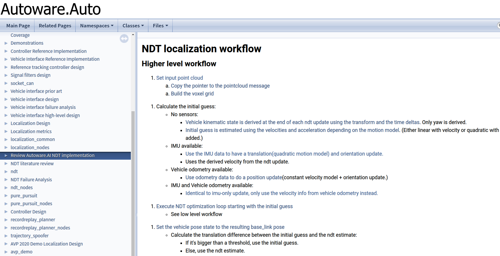
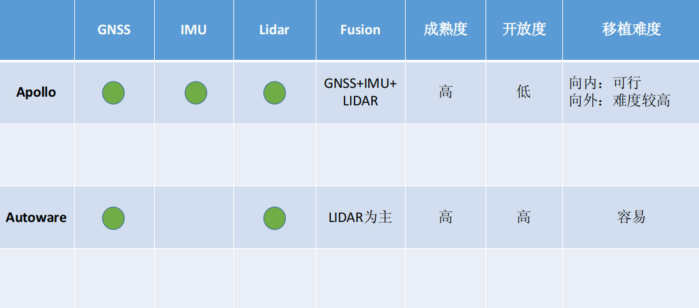
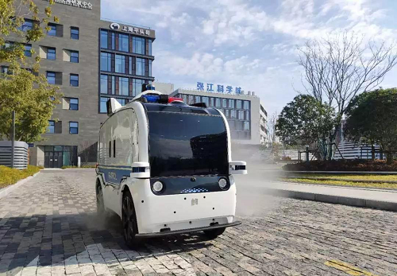
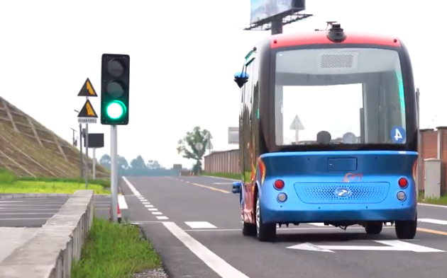
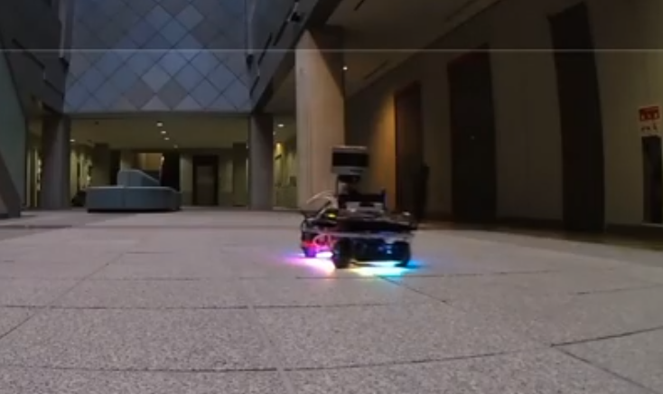

# 1. 面向对象

## 1.1. Apollo

- 低版本: 面向封闭场所的无人驾驶
- 高版本: 面向城市区域的无人驾驶为主

## 1.2. AutoWare 1.0

- 主要面向封闭区域

# 2. 项目架构

## 2.1. 基本架构

### 2.1.1. Apollo(完善但复杂)


### 2.1.2. AutoWare1.0(简化但Main)


##2.2.操作系统

cyberRT

Node

Component

reader/writer

调试难度：需要在

调试工具与开发流程比较


概念对照表与移植思路

| ---          | ---       | ---  |   ---    |
| ------------ | --------- | ---- | :------: |
| Apollo中概念 | ROS中概念 | 区别 | 移植思路 |


使用比较


性能比较


# 3. 功能实现

## 3.1. Localization

### 3.1.1. 技术简介

#### 3.1.1.1. Apollo中的定位技术

- RTK模式: 为了方便调试，Apollo自行实现了一套RTK解算，只使用RTK的定位信息。

> 现在惯导芯片一般都会配一个板卡（NovAtel也卖这样的板卡），直接集成了RTK的定位结果。为什么我们还需要自己开发GNSS-RTK呢？ 
> 从系统的角度考虑，需要每个子模块都是可控的，举一个简单的例子，当给出一个定位结果偏了，但给出的方差很小，也就是置信度很高。我们是没办法知道原因的。

- MSF(Multiple Sensor Fusion)模式: 采用Kalman滤波器，对位置、姿态和速度进行融合。
  
  - IMU: 惯导解算
  - LIDAR: NDT匹配算法
  - GPS: RTK解算
  
  使用松耦合的方式把惯性导航解算、GNSS定位、点云定位三个子模块融合在一起。(松耦合and紧耦合: 松耦合的数据只有位置、速度、姿态，紧耦合会包括GNSS的导航参数、定位中的伪距、距离变化等。)

  使用了一个误差卡尔曼滤波器，惯性导航解算的结果用于kalman滤波器的时间更新，也就是预测；而GNSS、点云定位结果用于kalman滤波器的量测更新
  
  

#### 3.1.1.2. Autoware(ROS)中的定位技术

- 基于3D Lidar的定位: 采用NDT点云配准算法进行定位，分别实现了
  - 基于PCL的NDT算法
  - 自行实现的NDT算法
  - 改进的NDT算法:NDT-TKU

- GNSS: 借助ROS社区，直接使用ROS开源的GNSS驱动，读取GPS-RTK的定位信息

参考文档

1. [Autoware.AI NDT文档](https://autowarefoundation.gitlab.io/autoware.auto/AutowareAuto/ndt-review.html)
2. [Autoware.AI 定位设计](https://autowarefoundation.gitlab.io/autoware.auto/AutowareAuto/localization-design.html)
3. [NDT定位算法原理](http://www.diva-portal.org/smash/get/diva2:276162/FULLTEXT02.pdf)


### 3.1.2. 技术成熟度

#### 3.1.2.1. Apollo

Apollo实现的RTK解算、MSF传感器融合定位，都有成熟的理论指导，成熟度较高。并且从Apollo最近的几个版本来看，定位模块的改动不大。

#### 3.1.2.2. Autoware

Autoware采用的NDT定位算法是2009年的一篇博士论文，目前仍被广泛应用，技术相对成熟，并且名古屋大学教授对此进行了改进，即NDT-TKU算法


### 3.1.3. 技术前沿性

从定位技术的前沿性来看，Apollo比Autoware领先，并且更加完善

#### 3.1.3.1. Apollo

从目前现有的代码来看，Apollo的RTK、MSF定位都是基于传统技术如:

- RTK解算
- GNSS/IMU解算
- NDT点云匹配
- ESKF误差卡尔曼

的堆叠，但是实际上Apollo提出了许多新的算法，如基于深度学习的点云匹配，基于深度学习的定位融合，虽然目前没有直接在Apollo代码中实现，不排除后续升级版本对定位模块的改进。

#### 3.1.3.2. Autoware

Autoware主要面向封闭环境，因此其认为，使用3D Lidar SLAM足以解决封闭环境的定位问题，而没有像Apollo那样实现GPS/IMU的融合解算，只是使用了EKF来对3D激光点云定位和GPS定位进行了融合，其`GPS定位信息转换模块`值得学习一下。

### 3.1.4. 源码开放度

#### 3.1.4.1. Apollo

Apollo虽说开源，但是核心部分还是抓的死死的，其中包括

- rtk解算`gnss_solver`
- 点云定位`lidar_locator`
- 惯导解算`sins.h`

**证据如下:**

在`modules/localization/msf/local_integ/localization_gnss_process.h`文件中，引用了

```C++
#include "include/gnss_solver.h"
```

在`modules/localization/msf/local_integ/localization_lidar.h`文件中，引用了

```C++
#include "include/lidar_locator.h"
```

在`modules/localization/msf/local_integ/localization_integ_process.h`文件中，引用了

```C++
#include "include/sins.h"
```

当然还有其他一些，上面引用的文件在源码中是找不到其影子的，因为这些头文件打包在Apollo的docker镜像中，至于对应`CPP`实现，那是不会给你哒，放心好了，早已编译成`.so`文件了

```
liblocalization_msf.so -> liblocalization_msf.so.1
liblocalization_msf.so.1 -> liblocalization_msf.so.1.0.2
liblocalization_msf.so.1.0.2
```

关于这部分的内容，更加具体的可参见文档:

1. [【Apollo】【localization】调试与分析](http://www.jeepxie.net/article/693907.html)

#### 3.1.4.2. Autoware

Autoware毕竟是基金组织，也没什么人投钱，基本上实现了的都开了

- 点云定位: NDT算法，有pcl版本的，也有自行实现版本的，有cpu版本的也有gpu版本的，最后，还有改进版本的
- GNSS: 直接使用ROS社区开源驱动

证据如下:


### 3.1.5. 指导文档

#### 3.1.5.1. Apollo

基本为0，除了其发表的论文：“万国伟，杨晓龙，蔡仁兰，李莉，周瑶，王浩，宋诗玉。“在不同的城市场景中基于多传感器融合的精确而精确的车辆定位”，2018 IEEE国际机器人与自动化会议（ICRA），布里斯班，昆士兰州，2018年，第4670-4677页。doi：10.1109 ”

#### 3.1.5.2. Autoware

具有详细的协议栈，开发文档，API接口，程序流图，以及所实现的算法原理



### 3.1.6. 可移植性

#### 3.1.6.1. Apollo

- 向内移植

  Apollo实现了一整套的底层接口、驱动，向内移植定位算法理论上可行。

  前提是:

  - 掌握Apollo的关于`Localization`协议栈，数据内容以及格式
  - 掌握相关底层设备的消息回调处理流程
  - 你得自己有算法

- 向外移植

  向外移植也不是不可以，但核心技术并不掌握在手中，谁会干这种事呢？

  前提工作:

  - 掌握Apollo的关于`Localization`协议栈，API接口，数据内容以及格式
  - 关于`Localization`部分所有**输入输出关系**全部掌握

#### 3.1.6.2. Autoware

完全基于ROS，移植性不言而喻。

### 3.1.7. 总结



总结就是，还是要有自己的核心算法呀。

## 3.2. Perception

## 3.3. Decision

## 3.4. Routing/Planning

##3.5.Control/Canbus

###3.5.1技术简介
Control是车辆与物理层交互的模型，Canbus是算法与硬件交互的链路。在接收到由planning发来的轨迹信号后，control模块驱动车辆进行对轨线的跟踪。
####3.5.1.1 Apollo中的Control/Canbus技术

- 模型建立与控制算法
	Apollo控制算法基于对车辆进行运动学与动力学建模的基础上，主要有三种，横向控制器，纵向控制器和MPC控制器。
	纵向控制通过油门和刹车控制车纵向的加减速，主要采用的是PID；而横向控制则通过控制方向盘的转动来控制前轮的方向，主要采用的是LQR，Apollo5.5更新了MARC模型参考自适应控制算法；除此之外的MPC模型预测控制，可以理解为实现同时对横向和纵向的控制。控制算法文件中还有一些组合模块（submodules)，具体使用情况不太清楚。
|方案|纵向控制|横向控制|
|:------:|:------:|:-------:|
|1|PID|LQR|
|2|MPC|MPC|
|3|PID|MARC|
|4|submodules|submodules|
以下只讨论PID与LQR控制，算法原理图如图。


参考书：Automatic Steering Methods for Autonomous Automobile Path Tracking

- 动力学标定
	我们需要控制汽车到达某个速度，根据牛顿经典力学，只需要知道汽车的初速度和加速度，就可以知道物体一段时候后的速度。因此我们只要找到速度，加速度和油门的关系，就可以通过控制汽车的加速度来让汽车达到某个速度。也就是对速度加速度和油门的关系进行建模，得到它们之间的关系。Apollo采用的是在实际的汽车行驶过程中记录不同速度下，不同的油门值对汽车的加速度的影响，从而得到一张表格，最后通过查表的方式来得到具体的油门和刹车值大小，得到的配置最后保存在conf文件夹中。
	这个表的生成需要测试每种油门以及每种速度下的表现，但是表不可能列出无限连续的数据，因此最后还是需要通过插值的方式来得到结果。
	对于动力学标定，Apollo提供了一套工具与方法。


- Canbus通讯与硬件底层

  Apollo中Control模块计算完cmd后按周期发送给canbus模块，再由canbus模块发送给CANBUS硬件，并定期从canbus模块接收关于底盘的相关信息，并将其打包发布。
- 输入 - 1. ControlCommand（控制命令，从control模块获得）
- 输出 - 1. Chassis（汽车底盘信息）, 2. ChassisDetail（汽车底盘信息详细信息）
  Apollo can信号采用DBC格式，消息分为接收和发送，不同消息对应不同ID，对于消息同一类型，接收和发送使用不同的消息ID。具体格式较为复杂。
  Apollo控制模块采用了代理模式，canbus模块采样了工厂模式，使Apollo能够适配不同车辆，但具体如何适配，如何将控制算法应用到实验室的前后轴转向车辆，还有很长的路要研究。

####3.5.1.2 ROS(Autoware)中的control/canbus技术


###3.5.2 技术成熟度
Apollo采用的控制算法都是较为实用，并在工程上应用较广泛的算法。算法本身与工程实现虽有难度，但门槛不高，核心点还是在系统建模层面。

###3.5.3技术前沿性
Apollo控制算法稳定可靠，经过实际测试。

###3.5.4源码开放度
未发现Apollo控制模块代码不开放的部分。
###3.5.5指导文档

csdn某博主https://blog.csdn.net/u013914471/article/details/82775091
Apollo各类公开课，公众号资源
GitHub Apollo

###3.5.6可移植性

因为我们目标是对一辆底盘模型不同的新车进行控制。而Apollo的控制模块实现了一整套的底层接口、驱动，无论是向内移植还是向外移植，理论上可行。

前提是:

 - 掌握Apollo的关于`Control`和`Canbus`协议栈，数据内容以及格式，理解输入输出关系
 - 将单转向协议修改或适配为前后转向协议
 - 进行对新车的建模，修改代码中部分参数，掌握标定方法
 - planning模块生成轨迹时需考虑新的车辆动力学模型

###3.5.7总结
Apollo控制算法成熟度高，可靠性高，技术门槛不高，但核心点还是在于对于目标模型的系统建模与工程上的算法实现。

# 4. 平台

## 4.1. 解决方案

### 4.1.1. Apollo

- 倒车入库
- Robo Taxi
- 智能信号灯控制系统
- 以及以下无人驾驶集成方案

#### 4.1.1.1. 新石器无人车



#### 4.1.1.2. Apolong



<iframe width="560" height="315" src="https://www.youtube.com/embed/5__S3FWD-Vg" frameborder="0" allow="accelerometer; autoplay; encrypted-media; gyroscope; picture-in-picture" allowfullscreen></iframe>
### 4.1.2. Autoware

基本上只在微型小车测试，尚无大型集成方案



<iframe width="560" height="315" src="https://www.youtube.com/embed/ojtQw9NPIaU" frameborder="0" allow="accelerometer; autoplay; encrypted-media; gyroscope; picture-in-picture" allowfullscreen></iframe>
## 4.2. 云服务

### 4.2.1. Apollo

Apollo提供有偿的云服务，包括:

- 高精地图
- 仿真平台
- 数据流
- V2X
- 车载平台

### 4.2.2. Autoware

无

## 4.3. 开发套件

### 4.3.1. Apollo

Apollo的`D-Kit`开发套件

### 4.3.2. Autoware

无

## 4.4. 规范认证

不详